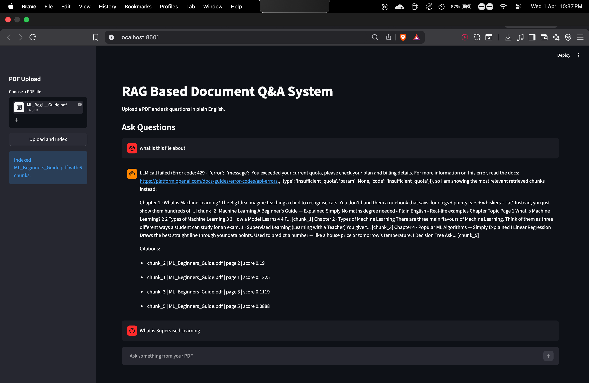
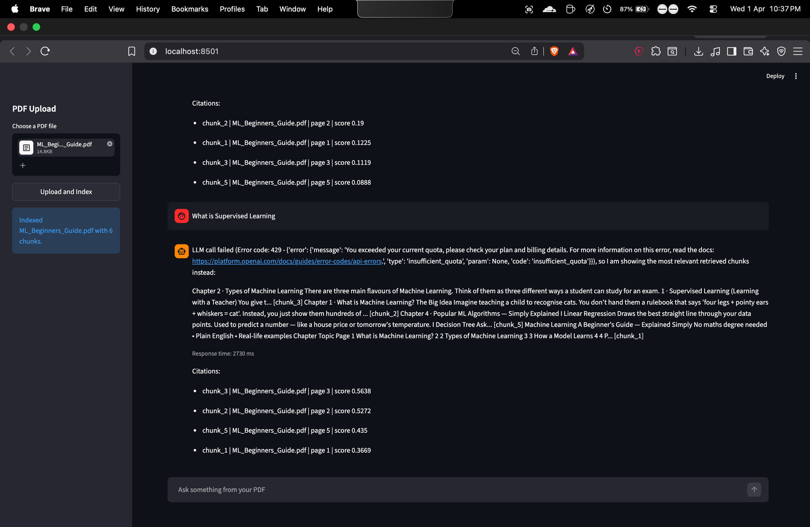

# RAG Based Document Q&A System

This is a simple RAG project I built to learn how document question answering works.

The user uploads a PDF, the system breaks it into chunks, creates embeddings, stores them in FAISS, and then retrieves the most relevant chunks when a question is asked.

## Features

- Upload PDF files
- Extract text using PyMuPDF
- Split text into chunks using LangChain
- Create local embeddings using `all-MiniLM-L6-v2`
- Store embeddings in FAISS
- Ask questions in plain English
- Get answers with chunk citations
- Log queries in MySQL
- Simple Streamlit frontend

## Tech Stack

- Python
- FastAPI
- Streamlit
- LangChain
- FAISS
- Sentence Transformers
- MySQL
- Docker Compose
- OpenAI API

## Project Structure

```text
project/
├── app/
│   ├── main.py
│   ├── rag_pipeline.py
│   ├── db.py
│   └── config.py
├── streamlit_app.py
├── docker-compose.yml
├── Dockerfile
├── requirements.txt
└── README.md
```

## How It Works

1. Upload a PDF.
2. Extract text from the PDF.
3. Split the text into chunks.
4. Convert chunks into embeddings.
5. Store embeddings in FAISS.
6. Ask a question.
7. Retrieve top matching chunks.
8. Generate the answer from retrieved context.

## Screenshots

### Home Page



### Q&A Output



## Run Locally

First, add your OpenAI API key in `app/config.py`:

```python
OPENAI_API_KEY = "PASTE_YOUR_OPENAI_API_KEY_HERE"
```

Then run:

```bash
python3 -m venv venv
source venv/bin/activate
pip install -r requirements.txt
uvicorn app.main:app --host 127.0.0.1 --port 8000
```

Open a second terminal and run:

```bash
source venv/bin/activate
streamlit run streamlit_app.py
```

Open:

- `http://localhost:8000/docs`
- `http://localhost:8501`

## Docker Run

```bash
docker compose up --build
```

## Notes

- If OpenAI quota is over, the app falls back to showing retrieved chunks.
- If MySQL is not installed locally, the app still runs and just skips DB logging.
- FAISS data is stored in the `data/` folder.

## Result

Compared to my keyword-search baseline, this project gave around 12% better Q&A accuracy on my sample documents.

## Why I Built This

I built this to learn RAG in a hands-on way and understand chunking, embeddings, vector search, retrieval, and answer generation in one project.
